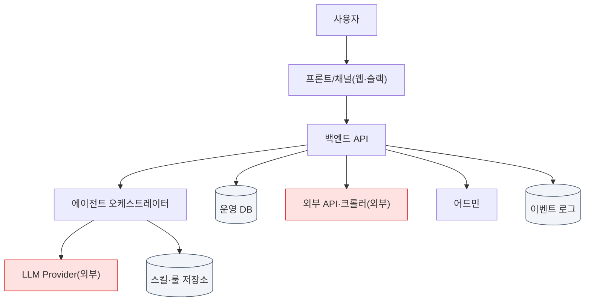
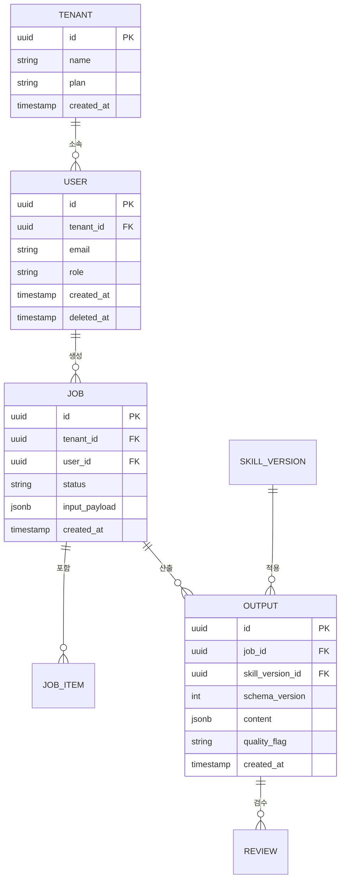
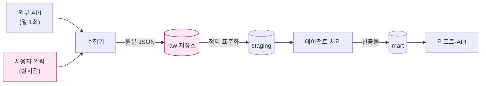
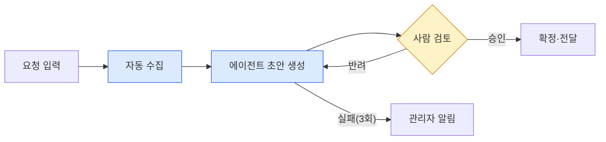
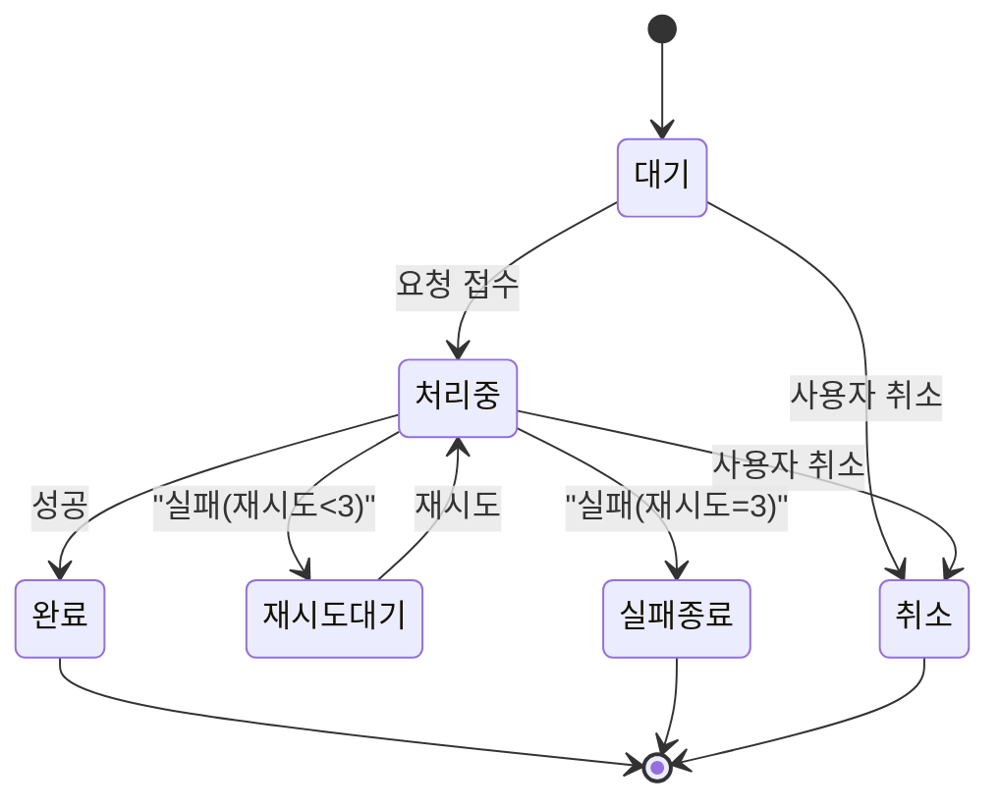
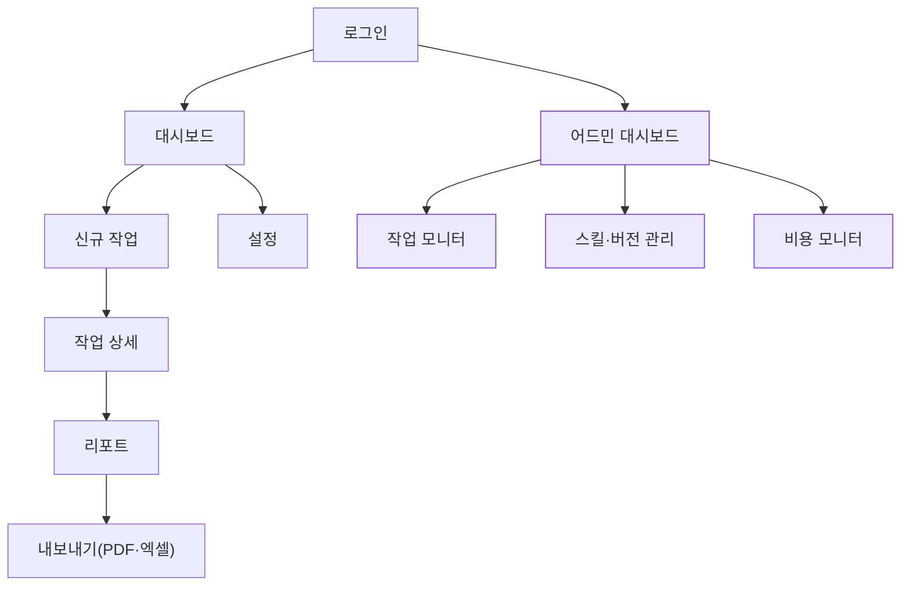

# PRD 작성 스킬

## 이 스킬의 목적

PRD의 품질 기준은 단 하나다 — **개발 착수 후 추가 질문이 최소화되는가.**

예쁜 문서를 만드는 게 아니라, 읽는 사람이 (그게 개발자든, 6개월 뒤의 본인이든) 바로 만들 수 있는 문서를 만든다. 그래서 이 스킬은 "무엇을 쓸지"보다 **"무엇을 확인하지 않으면 쓰면 안 되는지"** 에 무게를 둔다.

핵심 원칙 5가지:

1. **근거 없는 문장은 쓰지 않는다.** 시장 수치, 경쟁사 정보, 법률 판단은 전부 출처가 붙는다. 출처를 못 찾으면 "미확인"으로 명시한다. 추정치를 사실처럼 쓰는 순간 PRD는 쓰레기가 된다.
2. **확보 불가능한 데이터에 기반한 기획은 기획이 아니라 소설이다.** 데이터 확보 경로를 먼저 검증하고 기능을 설계한다.
3. **1인이 실제로 만들고 운영할 수 있어야 한다.** 못 만들 걸 쓰면 문서가 아니라 부채다.
4. **분량은 조사량의 결과지 목표가 아니다.** 최소 30페이지·최대 50페이지를 지키되, 미달이면 글을 늘리는 게 아니라 건너뛴 단계를 수행한다.
5. **구조는 글이 아니라 그림으로 전달된다.** 아키텍처, **데이터 모델(ERD)**, 데이터 플로우, 상태 전이는 반드시 다이어그램으로 낸다. 렌더가 깨진 다이어그램은 없는 것과 같으므로 문법 규칙(P7-0)을 지키고 확인한다.

---

## 전체 워크플로우

순서대로 진행한다. 각 단계 끝의 **게이트**를 통과하지 못하면 다음 단계로 넘어가지 않고, 사용자에게 무엇이 막혔는지 알린다.

```
P0 제품 정의 → P1 에이전트 역할 규정 → P2 시장조사(근거) → P3 시장 좁히기
→ P4 법률·리스크 → P5 데이터 전략 → P6 메타설계 → P7 아키텍처·시각화
→ P8 브랜딩→UI/UX → P9 어드민 → P10 1인 실행가능성 판정 → P11 개발 스펙
→ P12 확장 로드맵 → P13 데모 페이지 → 최종 셀프체크
```

시간이 없거나 사용자가 "빠르게"를 요구하면 P2·P4·P5·P10은 절대 생략하지 않는다. 이 4개가 프로젝트를 죽이는 단계다. 생략 가능한 건 P8(UI 컨셉 상세)과 P12(확장 로드맵 상세)뿐이다. P7의 ERD도 생략 대상이 아니다 — 이게 없으면 개발 착수 자체가 불가능하다. P13(데모)은 시간이 없으면 뒤로 미룰 수 있으나, 만들면 PRD의 구멍이 드러나므로 가급적 수행한다.

---

## 분량 기준 — 최소 30페이지, 최대 50페이지

### 왜 하한이 있는가

30페이지에 못 미치는 PRD는 거의 예외 없이 **조사를 덜 한 것**이지 간결한 게 아니다. 분량 미달은 보통 이런 신호다.

- 시장조사에서 출처를 찾지 않고 일반론으로 넘어갔다
- 법률 검토를 "문제없어 보인다" 한 줄로 처리했다
- 기능별 Unhappy Path를 안 썼다
- ERD·다이어그램을 안 그렸다

**분량이 모자라면 글을 늘리지 말고, 어느 단계를 건너뛰었는지 찾아 그 단계를 실제로 수행한다.**

### 왜 상한이 있는가

50페이지를 넘으면 아무도 안 읽는다. 안 읽히는 PRD는 없는 것과 같다. 초과했다면 다음을 의심한다.

- 결정이 아니라 설명을 쓰고 있다 ("~을 고려해야 한다", "~이 중요하다"는 결정이 아니다)
- 같은 내용을 여러 섹션에서 반복하고 있다
- 조사 원자료를 그대로 붙여넣었다 (부록으로 빼거나 요약한다)
- MVP 범위를 안 좁혔다 (P11-4로 돌아간다)

### 페이지 환산 기준

작성 환경마다 다르므로 **글자 수로 판정한다.**

| 단위 | 기준 |
|---|---|
| 1페이지 | 한글 공백 포함 **약 900자** (A4, 11pt, 줄간격 160% 기준) |
| **30페이지** | **약 27,000자** — 하한 |
| **50페이지** | **약 45,000자** — 상한 |
| 목표 | 32,000~40,000자 (35~44페이지) |

**P13 데모 페이지는 별도 산출물이므로 이 분량에 포함하지 않는다.** 데모에서 나온 결손 로그를 PRD에 반영한 결과만 분량에 잡힌다.

**다이어그램·표는 차지하는 지면으로 환산한다.** Mermaid 코드 블록은 렌더된 그림 크기로 계산하며, 통상 다이어그램 1개가 0.5~1페이지다. 6종 다이어그램 + 주요 표만으로 8~10페이지가 나온다.

작성 후 실제 글자 수를 세어 확인한다.

```bash
# 공백 포함 글자 수
wc -m PRD.md
# 대략적 페이지 환산
python3 -c "print(round(open('PRD.md').read().__len__()/900, 1), '페이지')"
```

### 섹션별 분량 배분

합계 기준선이다. ±30% 범위면 정상이다.

| 섹션 | 페이지 | 비고 |
|---|---|---|
| 1. 제품 정의 | 1 | 짧을수록 좋다. 길어지면 정의가 안 된 것 |
| 2. 에이전트 역할 범위 | 1~2 | 표 중심 |
| 3. 시장 분석 | **5~7** | 출처 테이블 포함. 여기가 가장 두껍다 |
| 4. 진입 쐐기·차별점 | 2~3 | 도메인 전문성 검증 포함 |
| 5. 법률 검토·리스크 | **4~6** | 판정표 + 리스크 레지스터 |
| 6. 데이터 전략 | 3~4 | 필수/독자 + 기준 데이터 |
| 7. 메타설계 | 2~3 | 스킬 레지스트리 + 개선 루프 |
| 8. 시스템 설계 | **6~8** | 다이어그램 6종 + ERD 부속 표 |
| 9. 브랜드·UI/UX | 3~4 | 리포팅·시각화 중점 |
| 10. 어드민 설계 | 2~3 | |
| 11. 1인 실행 가능성 | 2~3 | 공수·운영부하·자동화 표 |
| 12. 기능 요구사항 | **5~8** | 기능 수에 비례. AC + Unhappy Path |
| 13. 지표·트래킹 | 1~2 | 매핑표 |
| 14. 범위 경계·마일스톤 | 1~2 | |
| 15. 확장 로드맵 | 1~2 | |
| 부록 A. 출처 목록 | 1~2 | |
| 부록 B. 미확인 항목 | 1 | |
| **합계** | **약 41~61** | 상한 초과 시 12번과 3번부터 압축 |

**3·5·8·12번이 전체의 절반을 차지한다.** 이 넷이 얇으면 분량 미달이고, 동시에 PRD로서도 실패한 것이다.

### 분량을 채우는 올바른 방법

| 금지 | 권장 |
|---|---|
| 같은 말을 다르게 반복 | 출처를 더 찾아 근거를 두껍게 |
| "~이 중요하다" 류의 서술 | 기능별 Unhappy Path를 3개 이상씩 |
| 일반론·업계 상식 나열 | 경쟁사를 5개에서 10개로 확장 |
| 서론·배경 설명 추가 | 리스크 레지스터 항목별 대응책 구체화 |
| 같은 표를 형태만 바꿔 재게시 | 엔티티 정의서·인덱스 계획 상세화 |

**결정의 밀도가 기준이다.** 페이지당 최소 하나의 확정된 결정이 있어야 한다. 결정 없이 넘어가는 페이지가 연속 2장 나오면 그 부분은 잘라낸다.

### 게이트
- 공백 포함 27,000자 이상 45,000자 이하인가?
- 미달이라면 어느 단계를 건너뛰었는지 특정했는가? (글을 늘려서 채우지 않았는가)
- 초과라면 반복·설명·원자료 붙여넣기를 제거했는가?
- 3·5·8·12번 섹션이 전체의 절반 내외를 차지하는가?

---

## P0. 제품 정의 — 첫 화면에서 끝낸다

PRD를 연 사람이 **10초 안에** 이게 뭔지 알아야 한다. 문서 맨 앞에 아래 블록을 그대로 배치한다. 서론, 배경 설명, "최근 시장은..." 같은 도입부는 금지한다.

```markdown
## 한 줄 정의
[누가] [어떤 상황에서] [무엇을] [어떻게] 해주는 [제품 유형]

## 30초 요약
- 문제: (한 문장, 관찰된 사실 기반)
- 해결: (한 문장)
- 대상: (구체적 세그먼트 — "중소기업"은 대상이 아니다. "직원 5~20인 인테리어 시공사의 현장 관리자"가 대상이다)
- 핵심 차별점: (한 문장, 왜 기존 대안 대신 이걸 쓰는가)
- 형태: (웹앱 / 챗봇 / API / 데스크톱 도구 / 슬랙봇 ...)
```

**나쁜 예:** "AI 기반 업무 자동화 솔루션"
**좋은 예:** "5~20인 인테리어 시공사의 현장 관리자가, 카톡으로 흩어진 자재 발주 요청을 자동으로 정리해 발주서 초안까지 만들어주는 슬랙/카톡 봇"

### 게이트
- 한 줄 정의에서 대상·상황·행동이 전부 구체적인가?
- 이 제품을 모르는 사람에게 한 줄만 보여줬을 때 "아 그거"라고 반응할 수 있는가?

---

## P1. 에이전트 역할 규정 — 전체인가 부분인가

AI/에이전트가 들어가는 제품이라면, **에이전트가 제품 그 자체인지 업무의 한 조각인지**를 먼저 못 박는다. 이 축이 흔들리면 뒤의 모든 설계가 흔들린다. 아키텍처, 가격 모델, 신뢰성 요구 수준, 어드민 범위가 전부 여기서 갈린다.

아래 표를 채운다.

| 구분 | 내용 |
|---|---|
| 역할 유형 | ☐ 제품 전체형(에이전트가 서비스의 본체) / ☐ 부분 대행형(특정 업무 단계만 담당) / ☐ 보조형(사람이 결정, 에이전트는 초안·제안만) |
| 담당 업무 범위 | 전체 워크플로우 중 정확히 어느 구간인가 (앞단/뒷단은 누가 하나) |
| 인간 개입 지점 | 어디서 사람이 승인·수정·개입하나 (Human-in-the-loop 지점 명시) |
| 실패 시 대체 경로 | 에이전트가 못 할 때 무슨 일이 일어나나 (폴백은 필수다) |
| 자율성 수준 | ☐ 읽기만 / ☐ 초안 생성 / ☐ 승인 후 실행 / ☐ 자율 실행 |
| 책임 경계 | 에이전트 판단 오류로 손해 발생 시 책임 구조 (P4 법률과 연결) |

**전체형일수록** 신뢰성·평가체계·어드민 요구가 급격히 커진다. 1인 운영이라면 대부분 **부분 대행형 또는 보조형에서 시작**하는 게 현실적이다. 전체형으로 잡았다면 P10 실행가능성 판정에서 강하게 재검증한다.

### 게이트
- 워크플로우 다이어그램 위에 "에이전트 담당 구간"이 색으로 구분되어 표시되었는가?
- 자율 실행을 선택했다면, 오작동 시 롤백 방법이 정의되었는가?

---

## P2. 시장조사 — 웹크롤링 기반, 출처 없으면 쓰지 않는다

### 조사 방법

1. **웹 검색·크롤링을 기본 수단으로 사용한다.** 기억에 의존한 시장 수치·경쟁사 정보는 금지. 반드시 실제로 조회한다.
2. **필요하면 API까지 연결한다.** 아래 순서로 소스 등급을 올린다.
   - 1차: 공공/공식 API (국가통계포털, 공공데이터포털, 사업자등록 API, 특허검색 API, 앱스토어/플레이스토어 API, GitHub API 등)
   - 2차: 기업 공식 자료 (IR 자료, 사업보고서, 공식 블로그, 가격 페이지)
   - 3차: 리서치 기관·언론 보도
   - 4차: 커뮤니티·리뷰·SNS (정성 신호용. 수치 근거로는 쓰지 않는다)
3. **크롤링 시 준수사항**: robots.txt와 이용약관을 확인하고, 공식 API가 있으면 크롤링 대신 API를 쓴다. 로그인 벽 뒤 데이터·개인정보는 수집하지 않는다. 요청 간격을 두고 부하를 주지 않는다. 이 원칙은 P4에서 다시 검증된다.
4. **수치가 충돌하면 둘 다 적고 차이를 설명한다.** 유리한 쪽만 고르지 않는다.

### 출처 표기 형식 (필수)

모든 수치·주장 뒤에 인라인 마커를 달고, 섹션 끝에 출처 테이블을 붙인다.

```markdown
국내 시장 규모는 약 X억 원으로 추정된다 [S1]. 다만 다른 조사에서는 Y억 원으로 제시되어
집계 기준(B2B 한정 여부)에 차이가 있다 [S2].

### 출처
| ID | 출처명 | 발행처 | 발행일 | URL | 신뢰도 | 수집방법 |
|---|---|---|---|---|---|---|
| S1 | ... | ... | 2026-03 | https://... | 상 | 공식 API |
| S2 | ... | ... | 2025-11 | https://... | 중 | 웹크롤링 |
```

- **신뢰도**: 상(공식 통계·1차 자료) / 중(기업 발표·주요 언론) / 하(추정·커뮤니티)
- **발행일이 2년 이상 지난 자료는 신뢰도를 한 단계 낮추고 그 사실을 본문에 적는다.**
- **찾지 못한 항목은 빈칸으로 두지 말고 `[미확인 — 조사 필요]`로 명시한다.** 이게 나중에 리스크가 된다.

### 조사 항목

- 시장 규모·성장률 (TAM/SAM/SOM, 각각 산출 근거 포함)
- 경쟁사 5~10곳: 제품, 가격, 타겟, 강점, 명확한 약점, 최근 업데이트 시점
- 대체재 (경쟁 제품이 아니라 "엑셀", "카톡", "사람 고용" 같은 현실의 대안이 진짜 경쟁자다)
- 고객 불만 신호: 리뷰·커뮤니티에서 관찰된 실제 문장 (요약이 아니라 관찰된 패턴으로)
- 가격 벤치마크 표
- 진입 장벽 (자본/기술/규제/네트워크효과/데이터)

### 게이트
- 출처 없는 수치가 본문에 하나라도 있는가? → 있으면 제거하거나 미확인 표기
- 경쟁사 정보의 최신성 확인일이 기록되었는가?
- 공식 API로 얻을 수 있었는데 크롤링으로 대체한 항목이 있는가?

---

## P3. 시장 좁히기 — 과열 시장의 유일한 생존법

시장이 크고 경쟁이 치열하다면 그건 기회가 아니라 **경고**다. 1인 규모에서 정면 승부는 성립하지 않는다. 관건은 **얼마나 잘 좁히는가**다.

경쟁 강도를 먼저 판정한다.

| 신호 | 판정 |
|---|---|
| 자금 조달 받은 동일 카테고리 업체 5곳 이상 | 과열 |
| 빅테크가 기본 기능으로 번들링 중 | 과열(위험) |
| 검색 광고 단가가 높음 | 과열 |
| 상위 3사가 점유율 대부분 차지 | 성숙 |
| 명확한 리더가 없고 엑셀/수작업이 실질 경쟁자 | 기회 |

**과열/성숙이면 아래 6개 축 중 최소 2개를 조합해 좁힌다.** 하나만 좁히면 금방 따라잡힌다.

1. **버티컬**: 산업/업종 한정 (예: 전체 물류 → 콜드체인 식자재)
2. **워크플로우 구간**: 전체 흐름 → 가장 아픈 한 구간만
3. **고객 규모**: 대기업 솔루션이 안 닿는 5~20인 구간
4. **지역·언어·규제권**: 국내 규제·서식·상관행에 특화
5. **데이터 해자**: 남이 못 모으는 데이터 기반 기능 (P5와 연결)
6. **도메인 전문성**: 그 업계 사람만 아는 예외 처리·용어·판단 기준

좁힌 결과를 한 문장으로 확정한다.

```markdown
## 진입 쐐기(Wedge)
[좁힌 시장]에서 [구체적 한 가지 문제]를, [우리만의 강점] 때문에 가장 잘 푼다.
→ 여기서 이긴 다음 [확장 방향]으로 넓힌다.
```

### 도메인 전문성 검증 (필수)

이 제품에 **본인의 고유한 전문성이 실제로 반영되어 있는가**를 검증한다. 없으면 그 제품은 누구나 만들 수 있는 제품이고, 결국 자본이 이긴다.

아래 질문에 구체적으로 답할 수 없으면 기획을 다시 좁히거나 도메인을 바꾼다.

- 이 분야에서 내가 남보다 더 아는 것 3가지는? (일반론 말고 구체적 사실)
- 이 업무를 직접 해봤는가? 안 해봤다면 인터뷰·관찰로 확보한 1차 정보가 있는가?
- 이 도메인의 "함정" — 초보자가 반드시 틀리는 지점 — 을 3개 댈 수 있는가?
- 제품의 어느 기능이 이 전문성 없이는 설계 불가능한가? (구체적 기능명으로 지목)

전문성이 얕다면 정직하게 적고 보완 계획을 넣는다. 감추면 나중에 제품이 얕아진다.

### 게이트
- 쐐기 문장이 한 문장으로 나왔는가?
- 좁히기 축이 2개 이상 조합되었는가?
- 전문성이 반영된 기능이 구체적으로 지목되었는가?

---

## P4. 법률·정책 검토 — 합법/비합법 판정

**현행 법률과 정책에 근거해 이 제품이 합법인지 판정한다.** 근거 법령·조항·출처 없이 "문제없음"이라고 쓰지 않는다.

### 판정 절차

1. 제품 동작을 데이터 흐름 단위로 쪼갠다 (수집 → 저장 → 처리 → 제공 → 과금).
2. 각 단계에 걸릴 수 있는 법령을 검색으로 확인한다. 법령 원문·소관부처 자료·최근 가이드라인을 우선한다.
3. 아래 표로 판정한다.

| 항목 | 관련 법령·조항 | 판정 | 근거 | 출처 | 대응 |
|---|---|---|---|---|---|
| 개인정보 수집 | 개인정보보호법 제15조 등 | ☐합법 ☐조건부 ☐위법 ☐회색 | ... | [L1] | 동의 절차 설계 |
| 웹 크롤링 수집 | 저작권법 / 정보통신망법 / 약관 | ... | ... | [L2] | robots.txt 준수, API 전환 |
| 자격 필요 업무 | (의료/법률/세무/금융/부동산 등) | ... | ... | [L3] | 자문 형태 배제, 면책 고지 |
| AI 생성물 고지 | AI 관련 법·가이드라인 | ... | ... | [L4] | 산출물 AI 표기 |
| 광고·표시 | 표시광고법 | ... | ... | [L5] | 효과 표현 검토 |
| 결제·정산 | 전자상거래법 / 전자금융거래법 | ... | ... | [L6] | PG 위탁 |

**판정 기준**
- **합법**: 명시적 근거로 문제없음
- **조건부 합법**: 특정 절차(동의·고지·등록·보험)를 갖추면 가능 → 그 절차를 P11 요구사항에 반드시 반영
- **회색**: 판례·유권해석이 갈리거나 부재 → 전문가 검토 필요로 표시하고 보수적 설계 채택
- **위법**: 해당 기능 삭제 또는 구조 변경. **여기서 나온 위법 항목은 뒤 단계에서 조용히 되살아나면 안 된다.**

> 이 검토는 법률 자문이 아니다. 규제 밀접 영역(의료·금융·법률·개인정보 대량처리)이라면 실제 변호사·노무사·세무사 검토를 받으라고 PRD에 명시한다.

### 전체 리스크 레지스터

법률 외 리스크까지 한 표에 모은다. 리스크를 별도 문서로 빼지 않는다 — 안 읽힌다.

| ID | 유형 | 리스크 | 발생가능성 | 영향도 | 조기경보 신호 | 대응책 | 트리거 시 행동 |
|---|---|---|---|---|---|---|---|
| R1 | 법률 | ... | 상/중/하 | 상/중/하 | ... | ... | ... |
| R2 | 플랫폼 의존 | API 정책 변경·차단 | ... | ... | ... | ... | ... |
| R3 | 데이터 | 확보 경로 소실 | ... | ... | ... | ... | ... |
| R4 | 경쟁 | 빅테크 번들링 | ... | ... | ... | ... | ... |
| R5 | 운영 | 1인 병목·번아웃 | ... | ... | ... | ... | ... |
| R6 | 모델 | 비용 급증·성능 저하·모델 단종 | ... | ... | ... | ... | ... |
| R7 | 신뢰 | 에이전트 오작동으로 고객 손해 | ... | ... | ... | ... | ... |

**영향도 '상' 항목은 반드시 대응책과 트리거 행동이 채워져야 한다.**

### 게이트
- 위법 판정 기능이 제품 정의에 남아 있는가? → 있으면 P0으로 회귀
- 조건부 합법 항목의 필수 절차가 P11 요구사항으로 넘어갔는가?
- 크롤링 방식이 P2에서 쓴 방법과 법적으로 일관되는가?

---

## P5. 데이터 전략 — 확보 가능한 것만 기획한다

데이터는 두 종류다. 섞어서 다루면 반드시 헷갈린다.

### 5-1. 필수/독자 데이터 (제품이 돌아가게 하는 데이터)

제품 기능을 직접 구동하는 데이터. **독자성이 곧 해자**다.

| 데이터 | 용도(어느 기능) | 확보 경로 | 갱신 주기 | 확보 난이도 | 합법성(P4 연결) | 비용 | 대체 경로 |
|---|---|---|---|---|---|---|---|
| ... | ... | 공식API/크롤링/사용자입력/제휴/직접구축 | 실시간/일/주 | 상중하 | 합법/조건부 | ... | ... |

**핵심 검증**: 확보 난이도 '상'이고 대체 경로가 없는 데이터에 의존하는 기능은 **기획에서 뺀다.** 이게 이 단계의 존재 이유다. "이 데이터가 있으면 좋을 텐데"로 시작하는 기능은 전부 여기서 걸러낸다.

**독자 데이터 축적 설계**: 사용자가 제품을 쓸수록 자동으로 쌓이는 데이터가 무엇인지 정의한다. 쌓이는 데이터가 없으면 시간이 지나도 강해지지 않는 제품이다.
- 무엇이 쌓이는가 / 언제부터 의미 있는 양이 되는가 / 그게 어떤 기능을 좋게 만드는가

### 5-2. 기준 데이터 (평가·프로세스를 돌리는 데이터)

에이전트가 **어떻게 판단해야 하는지**를 규정하는 데이터. 스킬·룰·체크리스트·평가셋이 여기 속한다. 이걸 안 만들면 품질이 매번 달라지고, 개선해도 개선됐는지 알 수 없다.

| 기준 데이터 | 형태 | 출처 | 관리 주체 | 갱신 방식 |
|---|---|---|---|---|
| 도메인 판단 기준 | 스킬 md / 룰셋 | 본인 전문성 + 현장 인터뷰 | 본인 | 분기 |
| 산출물 품질 기준 | 체크리스트 / 루브릭 | ... | ... | ... |
| 평가셋(골든셋) | 입력-정답 쌍 N개 | 실제 사례 수집 | ... | 월 |
| 예외·함정 사례집 | 케이스 목록 | 운영 중 축적 | ... | 상시 |
| 용어·표기 사전 | 사전 파일 | ... | ... | ... |

**평가셋은 초기부터 만든다.** 최소 20~30건. 이게 없으면 프롬프트를 고쳐도 좋아졌는지 판단할 수 없고, 결국 감으로 운영하게 된다.

### 5-3. ERD로의 연결 (필수)

여기서 정의한 데이터는 **P7-2의 ERD에 실제 엔티티로 반영되어야 한다.** 표에만 있고 ERD에 없는 데이터는 개발 시 누락된다. 아래를 확인한다.

- 5-1의 각 데이터가 어느 엔티티·컬럼이 되는가?
- 5-2의 기준 데이터(스킬·룰·평가셋)도 엔티티로 관리되는가? 파일로만 두면 버전 관리와 롤백(P6)이 불가능하다.
- "사용할수록 쌓이는 독자 데이터"가 저장될 테이블이 ERD에 있는가?

### 게이트
- 확보 불가 데이터에 의존하는 기능이 남아 있는가?
- 각 데이터의 합법성이 P4 표와 일치하는가?
- 평가셋 규모와 수집 방법이 정해졌는가?
- **여기의 모든 데이터가 P7-2 ERD의 엔티티로 매핑되었는가?**

---

## P6. 메타설계 — 스킬을 위한 스킬

에이전트 제품의 진짜 자산은 기능이 아니라 **판단 기준을 계속 개선하는 구조**다. 기준을 사람이 매번 손으로 고치면 그게 병목이 되고, 1인 운영에서는 곧 정체를 뜻한다.

### 스킬 레지스트리

제품이 사용하는 스킬/프롬프트/룰을 단일 목록으로 관리한다.

| 스킬ID | 이름 | 역할 | 입력 | 출력 | 상위 스킬 | 버전 | 평가 지표 |
|---|---|---|---|---|---|---|---|
| SK-01 | ... | ... | ... | ... | - | v1.0 | 정확도/합격률 |

### 메타 스킬 3종 (최소 구성)

1. **생성 메타스킬**: 새 케이스 유형이 나왔을 때 그에 맞는 하위 스킬을 만들어내는 스킬. 입력은 케이스 예시, 출력은 스킬 초안.
2. **평가 메타스킬**: 산출물을 루브릭 기준으로 채점하는 스킬. 사람의 감이 아니라 기준으로 채점되어야 개선 여부를 알 수 있다.
3. **개선 메타스킬**: 실패 사례를 모아 원인을 분류하고, 어느 스킬의 어느 부분을 고쳐야 하는지 제안하는 스킬.

### 개선 루프

```
운영 산출물 → 평가 메타스킬 채점 → 실패 케이스 수집 → 원인 분류
→ 개선 메타스킬이 스킬 수정안 제시 → 사람이 승인 → 버전 갱신 → 평가셋 재실행 → 회귀 확인
```

**버전 관리와 롤백을 반드시 넣는다.** 스킬 수정이 기존 케이스를 망가뜨리는 일이 실제로 자주 일어난다. 수정 후 평가셋 전체를 다시 돌려 회귀를 확인하는 절차가 없으면 이 루프는 위험하다.

### 게이트
- 메타 스킬 3종의 입출력이 정의되었는가?
- 롤백 방법과 회귀 검증 절차가 있는가?
- 이 루프에서 사람이 하는 일의 시간 비용이 P10에 반영되었는가?

---

## P7. 설계 구조와 시각화 — 그림 없는 PRD는 미완성

**이 섹션은 이 문서에서 가장 중요한 부분 중 하나다.** 구조는 문장으로 전달되지 않는다. 아래 **6종 다이어그램은 전부 만든다.** 하나라도 빠지면 이 단계는 미완료다.

### 7-0. Mermaid 작성 규칙 (반드시 먼저 읽는다)

다이어그램을 그렸는데 렌더가 깨지면 없는 것과 같다. 한글로 작성할 때 특히 자주 깨지므로 아래 규칙을 지킨다.

**규칙 1 — 노드 ID는 ASCII, 라벨은 한글.** ID에 한글·공백·하이픈을 쓰지 않는다.

```
잘못: 사용자 --> 백엔드 API
올바름: USER[사용자] --> API[백엔드 API]
```

**규칙 2 — 라벨에 `(` `)` `[` `]` `{` `}` 가 있으면 반드시 큰따옴표로 감싼다.** 이 세 종류의 괄호가 파서를 깨뜨리는 실제 원인이다.

```
잘못: A[결제(PG 연동)]
올바름: A["결제(PG 연동)"]
```

`:` `,` `/` `%` `.` `-` `;` 는 따옴표 없이도 동작한다. 다만 라벨에 **큰따옴표 자체**를 넣으려면 `#quot;` 로 이스케이프한다.

```
A["사용자의 #quot;입력#quot;"]
```

판단이 서지 않으면 **그냥 전부 따옴표로 감싼다.** 따옴표를 씌워서 깨지는 경우는 없다.

**규칙 3 — `end`, `graph`, `class`, `click`, `style` 은 노드 ID로 쓰지 않는다.** 예약어라 조용히 깨진다. `END_NODE` 처럼 바꾼다.

**규칙 4 — 화살표 라벨은 파이프로 감싼다.** 라벨에 특수문자가 있으면 여기에도 따옴표를 쓴다.

```
A -->|승인| B
A -->|"실패(3회)"| C
```

**규칙 5 — 줄바꿈은 `<br/>`.** `\n` 은 동작하지 않는다.

**규칙 6 — subgraph 제목에 공백이나 한글이 있으면 따옴표와 ID를 함께 쓴다.**

```
subgraph SG1["에이전트 담당 구간"]
  ...
end
```

**규칙 7 — 색 구분은 `classDef` 로 한다.** 에이전트 담당 구간과 사람 개입 지점 구분에 반드시 쓴다.

```
classDef agent fill:#dbeafe,stroke:#2563eb
classDef human fill:#fef3c7,stroke:#d97706
class AG,LLM agent
class REVIEW human
```

**규칙 8 — 다이어그램 하나에 노드 20개를 넘기지 않는다.** 넘으면 읽을 수 없어진다. 레이어별로 쪼갠다.

**규칙 9 — 작성 후 반드시 렌더 확인을 한다.** 확인할 수 없는 환경이라면 사용자에게 "렌더 확인 필요"를 명시한다. 깨진 다이어그램을 그대로 넘기지 않는다.

**규칙 10 — 모든 다이어그램에는 대응하는 표를 함께 낸다.** 렌더가 실패해도 정보가 살아남고, 개발자가 실제로 참조하는 건 표인 경우가 많다.

---

### 필수 다이어그램 6종

#### 1) 시스템 아키텍처

컴포넌트, 외부 의존성, 데이터 저장소, 신뢰 경계를 표시한다.



**외부 의존성은 반드시 다른 색으로 표시한다.** 이게 곧 P4 리스크 레지스터의 R2(플랫폼 의존)와 R6(모델 비용·단종) 대상이다.

동반 표:

| 컴포넌트 | 역할 | 의존 대상 | 장애 시 영향 | 대체 수단 |
|---|---|---|---|---|

#### 2) 데이터 모델 / ERD (필수 — 생략 금지)

**데이터 구조를 그리지 않은 PRD는 개발 착수가 불가능하다.** 기능 명세만으로는 테이블을 만들 수 없고, 결국 개발자가 임의로 설계하게 되어 P12 확장 대비가 전부 무너진다.



**ERD 작성 시 반드시 반영할 것 (P12 확장 대비와 직결)**

| 항목 | 이유 |
|---|---|
| **`tenant_id` 를 처음부터 넣는다** | 나중에 추가하면 전 데이터 마이그레이션이다 |
| **PK는 UUID 권장** | 병합·이관·외부 노출 시 유리 |
| **`created_at` / `updated_at` 전 테이블 공통** | 없으면 디버깅이 불가능해진다 |
| **`deleted_at` (soft delete)** | 하드 삭제는 복구 불가. 어드민 대응이 막힌다 |
| **산출물에 `schema_version`** | 포맷 변경 시 과거 데이터 호환 |
| **스킬·룰은 버전 엔티티로 분리** | P6 롤백·회귀검증의 전제 조건 |
| **원본 이벤트 로그 테이블 별도** | 새 지표를 소급 계산할 수 있다 |
| **개인정보 컬럼 표시** | P4 판정 대상. 보관기간·삭제 정책을 컬럼 단위로 정한다 |

동반 표 — 엔티티 정의서:

| 엔티티 | 설명 | 주요 키 | 관계 | 예상 규모(1년) | 개인정보 | 보관기간 |
|---|---|---|---|---|---|---|
| USER | 서비스 이용자 | PK id, FK tenant_id | TENANT 1:N | ~5천 | 이메일 | 탈퇴 후 30일 |
| JOB | 처리 요청 단위 | PK id, FK user_id | USER 1:N | ~50만 | 없음 | 3년 |

**예상 규모를 반드시 추정한다.** 연 5천만 건이 쌓이는 테이블과 5천 건짜리 테이블은 설계가 완전히 달라진다.

인덱스 계획도 함께 낸다 — 나중에 붙이려면 서비스를 멈춰야 하는 경우가 있다.

| 테이블 | 인덱스 | 대상 쿼리 |
|---|---|---|
| JOB | (tenant_id, status, created_at) | 어드민 작업 모니터 |
| OUTPUT | (job_id) | 산출물 조회 |

#### 3) 데이터 플로우

수집부터 산출까지. **각 화살표에 데이터 형태와 주기를 적고, 개인정보가 지나는 구간은 별도 색으로 표시한다**(P4 연결).



#### 4) 사용자 여정 / 워크플로우

**에이전트 담당 구간과 사람 개입 지점을 색으로 구분한다**(P1 연결). 이 구분이 없으면 P1의 역할 규정이 문서상 선언에 그친다.



#### 5) 상태 전이도

핵심 객체(작업·문서·주문 등)의 상태 변화. **실패·재시도·취소 경로를 반드시 포함한다.** 해피패스만 그린 상태도는 미완성이다.



동반 상태 전이표 — **개발자가 실제로 보는 건 표다.**

| 현재 상태 | 이벤트 | 다음 상태 | 조건 | 부수효과(알림·기록) |
|---|---|---|---|---|
| 대기 | 요청 접수 | 처리중 | 인증 통과 | 접수 로그 |
| 처리중 | 실패 | 재시도대기 | 재시도<3 | 에러 기록 |
| 처리중 | 실패 | 실패종료 | 재시도=3 | 관리자 알림 |
| 처리중 | 사용자 취소 | 취소 | 진행률<100% | 취소 로그, 과금 취소 |

#### 6) 화면 흐름도

주요 화면과 이동 경로. **어드민 화면을 반드시 포함한다**(P9 연결).



### 게이트
- **6종 다이어그램이 전부 들어갔는가? (ERD 포함 — 이게 가장 자주 누락된다)**
- 모든 Mermaid 코드가 7-0 규칙을 지켰고, 렌더 확인을 했거나 확인 필요를 명시했는가?
- 모든 다이어그램에 동반 표가 있는가?
- ERD에 `tenant_id`, 타임스탬프, soft delete, 개인정보 표시가 반영되었는가?
- 엔티티별 예상 규모와 인덱스 계획이 있는가?
- 상태 전이도에 실패·재시도·취소 경로가 있는가?
- 외부 의존성이 아키텍처에 별도 색으로 표시되었는가?
- 워크플로우에 에이전트 구간과 사람 개입 지점이 색으로 구분되었는가?

---

## P8. 브랜딩 → UI/UX 컨셉

브랜드를 먼저 정하고, 거기서 UI를 도출한다. 순서가 반대면 UI가 기본 템플릿처럼 보인다.

### 8-1. 브랜드 정의

```markdown
- 브랜드 한 줄: (제품이 사용자에게 주는 느낌)
- 톤앤매너 3개 형용사: (예: 정확한 / 차분한 / 군더더기 없는)
- 안티-톤 2개: (절대 피할 인상. 예: 장난스러움, 과장된 마케팅 톤)
- 이름·네이밍 근거:
- 사용자가 이 제품을 남에게 설명할 때 쓸 것 같은 문장:
```

### 8-2. 비주얼 컨셉 도출

브랜드 형용사 각각을 시각 요소로 번역한다. 근거 없이 색을 고르지 않는다.

| 브랜드 속성 | 시각적 번역 | 구체값 |
|---|---|---|
| 정확한 | 정렬 격자, 등폭 숫자 | 8pt 그리드, tabular-nums |
| 차분한 | 저채도, 넓은 여백 | 중성 배경 + 액센트 1색 |
| 군더더기 없는 | 장식 제거, 타이포 위계로 구분 | 서체 2종 이내 |

- 컬러: 배경/표면/텍스트/액센트/의미색(성공·경고·오류) — 다크모드 대응 여부
- 타이포: 서체, 크기 스케일, 숫자 표기(자릿수 구분, 단위 위치)
- 컴포넌트: 카드/테이블/폼/빈 상태/로딩/오류 상태 — **빈 상태와 오류 상태를 반드시 설계한다.** 실제 사용의 상당 부분이 이 상태다.

### 8-3. 리포팅·데이터 시각화 (중점 영역)

이 제품의 가치가 산출물로 전달된다면, 리포트 화면이 곧 제품이다. 각별히 설계한다.

**리포트 설계 원칙**
- 결론이 맨 위에 온다. 데이터를 나열하고 결론을 아래 두면 아무도 안 읽는다.
- 모든 수치에 **비교 기준**을 붙인다 (전기 대비, 목표 대비, 동종 평균 대비). 비교 없는 숫자는 해석 불가다.
- 모든 수치에 **출처·산출식·기준 시점**을 표시한다. P2의 출처 원칙이 제품 안에서도 그대로 적용된다.
- 데이터 부족·신뢰도 낮음 상태를 시각적으로 표현한다. 없는 걸 있는 척 그리지 않는다.

**차트 선택 기준**

| 목적 | 권장 | 피할 것 |
|---|---|---|
| 시간 추이 | 라인 | 3D, 누적 남용 |
| 구성비 | 가로 막대(정렬) | 파이(항목 4개 초과 시) |
| 항목 비교 | 정렬된 가로 막대 | 세로 막대(라벨 길 때) |
| 분포 | 히스토그램/박스 | 평균만 표기 |
| 상관 | 산점도 | 인과로 표현 |
| 진행 상태 | 진행 바 + 목표선 | 게이지 남용 |

**리포트 화면 구조 (기본 템플릿)**
```
[헤더] 기간 · 대상 · 데이터 기준시점 · 신뢰도 배지
[요약] 핵심 결론 3줄 + 주요 지표 3~4개(전기 대비 델타 포함)
[본문] 지표별 섹션 — 차트 + 한 줄 해석 + 근거 데이터 접기
[액션] 권장 조치 (클릭하면 해당 기능으로 이동)
[부록] 출처 목록, 산출식, 제외 조건
```

**출력 형태**: 화면 / PDF / 엑셀 / 이메일 요약 중 무엇을 지원하는지 명시. PDF·엑셀은 별도 레이아웃 작업이 필요하므로 범위에 넣을지 여기서 결정한다.

### 게이트
- 브랜드 형용사가 구체적 시각값으로 번역되었는가?
- 빈 상태·오류 상태·데이터 부족 상태 UI가 정의되었는가?
- 리포트에 비교 기준과 출처 표기가 들어갔는가?

---

## P9. 어드민 — 기본으로 설계한다

어드민은 나중에 만드는 게 아니라 **1차 범위에 포함한다.** 1인 운영에서 어드민 없이는 장애 대응·고객 문의 처리가 전부 DB 직접 조회가 되고, 그 순간 운영이 무너진다.

### 최소 어드민 범위 (전부 필수)

| 영역 | 기능 | 왜 필요한가 |
|---|---|---|
| 사용자 관리 | 조회·검색, 상태 변경, 강제 비활성화 | 문의 대응의 출발점 |
| 사용 현황 | 계정별 사용량, 최근 활동, 오류 발생 | 이상 징후 조기 발견 |
| 작업 모니터 | 진행/실패 작업 목록, 재시도, 강제 종료 | 장애 시 유일한 수단 |
| 산출물 검수 | 결과물 조회, 품질 플래그, 수동 수정 | 신뢰성 확보의 핵심 |
| 스킬·룰 관리 | 버전 조회, 활성화/롤백 (P6 연결) | 품질 개선 루프 |
| 데이터 소스 상태 | 크롤러·외부API 성공률, 마지막 성공 시각 | 데이터 끊김 감지 |
| 비용 모니터 | LLM/API 호출량·비용, 계정별 원가 | 비용 폭주 방지 |
| 감사 로그 | 누가 무엇을 언제 (관리자 행위 포함) | 분쟁·규제 대응(P4) |
| 공지·알림 | 사용자 공지, 관리자 알림 채널 | 장애 커뮤니케이션 |

### 알림 설계 (1인 운영 필수)

수동으로 매일 확인하는 대시보드는 결국 안 본다. **밀어주는 알림**으로 설계한다.

| 조건 | 채널 | 긴급도 |
|---|---|---|
| 작업 실패율 임계 초과 | 슬랙/카톡 | 즉시 |
| 외부 데이터 소스 수집 실패 | 슬랙 | 즉시 |
| 일일 비용 임계 초과 | 슬랙 | 즉시 |
| 신규 가입·결제·해지 | 슬랙 | 일반 |
| 산출물 품질 플래그 발생 | 슬랙 | 일반 |

### 게이트
- 어드민이 MVP 범위에 포함되었는가?
- 장애 발생 시 DB 직접 접근 없이 대응 가능한가?
- 비용 임계 알림이 있는가?

---

## P10. 1인 실행 가능성 판정 — 정직하게 판정한다

여기서 "가능하다"고 쓰고 싶은 유혹이 크다. 하지만 이 판정을 관대하게 하면 나머지 문서 전체가 무의미해진다.

### 10-1. 구축 공수 추정

| 영역 | 작업 | 예상 소요 | 난이도 | 외주/도구 대체 가능 |
|---|---|---|---|---|
| 코어 기능 | ... | X주 | ... | ... |
| 데이터 파이프라인 | ... | ... | ... | ... |
| 에이전트·스킬 | ... | ... | ... | ... |
| 프론트·리포트 | ... | ... | ... | ... |
| 어드민 | ... | ... | ... | ... |
| 결제·인증 | ... | ... | ... | SaaS 대체 |
| **합계** | | **X주** | | |

**보정**: 추정치에 1.5~2배를 곱한다. 개인 프로젝트 추정은 거의 항상 낙관적이다.

### 10-2. 운영 부하 추정 (더 중요하다)

만드는 건 끝이 있지만 운영은 끝이 없다. 여기서 무너지는 경우가 훨씬 많다.

| 반복 업무 | 빈도 | 건당 시간 | 주간 합계 | 자동화 가능성 |
|---|---|---|---|---|
| 고객 문의 응대 | ... | ... | ... | 템플릿/FAQ 봇 |
| 산출물 품질 검수 | ... | ... | ... | 평가 메타스킬(P6) |
| 데이터 소스 점검 | ... | ... | ... | 자동 알림(P9) |
| 스킬 개선 | ... | ... | ... | 부분 자동화 |
| 영업·마케팅 | ... | ... | ... | 제한적 |
| **주간 총합** | | | **X시간** | |

**판정 기준**
- 주간 운영 부하 **15시간 초과** → 고객 100명 시점에서 붕괴한다. 자동화 또는 범위 축소 필수.
- 사람 검수가 건별로 필요한 구조 → 매출이 늘면 부하도 선형으로 는다. 확장 불가 구조다.
- 실시간 대응 SLA가 필요한 제품 → 1인으로는 사실상 불가능. 비동기 구조로 재설계한다.

### 10-3. 워크플로우 자동화 설계

부하 큰 항목부터 자동화를 설계한다.

| 대상 | 현재(수동) | 자동화 방식 | 사람이 남길 부분 | 절감 |
|---|---|---|---|---|
| ... | ... | 배치/웹훅/알림/템플릿 | 최종 승인만 | X시간/주 |

원칙: **사람은 판단만, 기계는 수집·정리·초안·알림.** 사람이 복사·붙여넣기·확인 클릭을 하고 있다면 자동화 대상이다.

### 10-4. 최종 판정

```markdown
## 1인 실행 가능성 판정
- 구축: X주 (보정 후 Y주)
- 주간 운영 부하: Z시간
- 판정: ☐ 가능 / ☐ 조건부 가능(범위 축소 필요) / ☐ 불가능
- 조건부라면 잘라낼 기능: (구체적으로)
- 불가능하다면 대안: (범위 축소 / 협업 / 아이템 변경)
```

**조건부·불가능 판정이 나오면 P0로 돌아가 범위를 줄인다.** 그대로 진행하지 않는다.

---

## P11. 개발 착수용 스펙

여기까지의 결정을 개발 가능한 형태로 확정한다. 기준은 하나 — **읽고 나서 질문이 몇 개 생기는가.**

### 11-1. 기능 요구사항

각 기능마다:

```markdown
### F-01 [기능명]
- 목적: (어떤 사용자 문제를 해결)
- 우선순위: P0(없으면 출시 불가) / P1 / P2
- 사용자 스토리: [역할]로서 [목적]을 위해 [행동]할 수 있다
- 선행 조건:
- 수용 기준 (조건-행동-결과):
  - AC-1: [조건]일 때 [행동]하면 [결과]가 발생한다
  - AC-2: ...
- Unhappy Path (필수 — 최소 3개):
  - 입력이 잘못된 경우: ...
  - 외부 API가 실패한 경우: ...
  - 권한이 없는 경우 / 데이터가 없는 경우 / 타임아웃: ...
- 관련 데이터: (P5 표 참조)
- 관련 화면: (P7-5 참조)
```

**Unhappy Path가 비어 있는 기능은 미완성으로 간주한다.** 개발 중 질문의 대부분이 여기서 나온다.

### 11-2. 비기능 요구사항

응답 시간 목표 / 동시 처리량 / 데이터 보관 기간·삭제 정책(P4) / 백업 / 인증·권한 등급 / 로깅 범위 / 접근성 / 브라우저·기기 지원 범위.

### 11-3. 지표 → 트래킹 이벤트 매핑

측정하겠다고 적은 지표는 반드시 수집 이벤트로 연결한다. 연결 안 된 지표는 출시 후 측정 불가 상태가 된다.

| 지표 | 정의(산출식) | 이벤트명 | 발생 시점 | 속성 | 목표값 |
|---|---|---|---|---|---|
| 활성화율 | 가입 후 7일 내 첫 산출물 생성 비율 | `output_created` | 생성 완료 시 | user_id, type, duration | 40% |
| 산출물 채택률 | 생성물 중 사용자가 수정없이 사용한 비율 | `output_accepted` | 다운로드/전송 시 | output_id, edited | 60% |

### 11-4. 범위 경계

**하지 않는 것**을 명시한다. 이게 없으면 범위가 무한히 늘어난다.

```markdown
## MVP에 포함하지 않는 것
- [기능] — 이유: ... / 언제 재검토: ...
```

### 11-5. 마일스톤

| 단계 | 산출물 | 완료 기준(검증 가능한 형태) | 기간 |
|---|---|---|---|

---

## P12. 확장 로드맵과 그에 대비한 설계

확장을 나중에 생각하면 재작성이 필요해진다. **지금 하지 않되, 막지는 않는 설계**를 한다.

### 확장 시나리오

| 방향 | 내용 | 시점 | 선결 조건 |
|---|---|---|---|
| 수직 확장 | 같은 고객에게 인접 업무까지 | ... | ... |
| 수평 확장 | 같은 기능을 다른 업종으로 | ... | ... |
| 데이터 확장 | 축적 데이터로 벤치마크·인사이트 판매 | ... | 표본 N 이상 |
| 채널 확장 | API·플러그인 제공 | ... | ... |

### 확장 대비 설계 원칙 (지금 지킬 것)

- **도메인 규칙을 코드에 하드코딩하지 않는다.** 스킬/설정 데이터로 분리한다 → 업종 확장 시 코드 수정 불필요 (P6과 직결).
- **테넌트 구분자를 스키마에 처음부터 넣는다.** 나중에 추가하면 전 데이터 마이그레이션이다.
- **외부 연동은 어댑터 계층으로 감싼다.** API 교체·차단(R2) 대응이 국소화된다.
- **집계용 이벤트 로그를 원본 그대로 남긴다.** 나중에 새 지표를 소급 계산할 수 있다.
- **산출물에 스키마 버전을 붙인다.** 포맷 변경 시 과거 데이터 호환.

**과설계 경고**: 위 5가지 외의 확장 대비는 하지 않는다. 안 올 미래를 위한 추상화는 1인 개발에서 가장 흔한 실패 원인이다.

---

## P13. 데모 페이지 — PRD를 눌러볼 수 있게 만든다

PRD를 다 쓰고 나면 **PRD만 보고 클릭 가능한 데모 페이지를 만든다.** 읽는 것과 눌러보는 것은 다른 검증이다.

### 왜 만드는가

데모의 1차 목적은 예쁜 시안이 아니라 **PRD의 구멍을 찾는 것**이다.

화면을 실제로 만들어보면 PRD에 안 적힌 것들이 즉시 드러난다. 이 버튼을 누르면 어디로 가는가, 목록이 비었을 때 뭐가 보이는가, 이 값은 어디서 오는가, 저장 중에는 무엇을 보여주는가. **데모를 만들다 막히는 지점이 곧 PRD가 비어 있는 지점이다.**

2차 목적이 설명이다. 개발자·고객·투자자에게 문서 40페이지를 읽히는 것보다 3분 클릭이 빠르다.

### 절대 규칙 — PRD만 보고 만든다

**PRD에 없는 것을 임의로 지어내지 않는다.** 만들다가 필요한데 PRD에 없으면, 상상해서 채우지 말고 **결손 로그에 기록**한다. 이게 이 단계의 핵심 산출물이다.

| 결손 ID | 데모의 어느 지점 | 없는 정보 | PRD 어느 섹션에 들어가야 하나 | 임시 처리 |
|---|---|---|---|---|
| G-01 | 작업 목록 화면 | 정렬 기본값 미정 | 12. 기능 요구사항 F-03 | 최신순 가정, 화면에 `[가정]` 배지 |
| G-02 | 리포트 화면 | 데이터 부족 시 표시 미정 | 9. UI/UX | 빈 상태 임시 설계 |

**가정으로 채운 부분은 데모 화면 위에 `[가정]` 배지로 눈에 보이게 표시한다.** 배지 없이 채워 넣으면 나중에 그게 확정 사양인 줄 알고 개발된다.

결손 로그를 정리한 뒤 PRD로 돌아가 해당 섹션을 보강한다. **데모는 PRD를 대체하지 않고 PRD를 고치는 도구다.**

### 기술 제약

| 항목 | 규칙 |
|---|---|
| 형식 | **단일 HTML 파일** (CSS·JS 인라인). 배포·공유·첨부가 쉬워야 한다 |
| 데이터 | 하드코딩 목업. 실제 API 호출 금지 |
| 상태 관리 | JS 변수·객체. **`localStorage`·`sessionStorage` 사용 금지** — 아티팩트 환경에서 동작하지 않는다 |
| 라우팅 | 화면 전환은 DOM 표시/숨김 또는 해시. 외부 라우터 불필요 |
| 인증·결제 | 화면만 흉내. 실제 구현 금지 |
| 반응형 | 데스크톱 우선. 모바일이 주 채널이면 반대로 |
| 분량 | 파일 하나로 관리 가능한 수준. 화면 8개를 넘기면 핵심만 남긴다 |

### 필수 포함 요소

**1) 핵심 워크플로우 (P7-4 워크플로우 다이어그램을 그대로 따라간다)**

해피패스 하나를 처음부터 끝까지 클릭으로 완주할 수 있어야 한다. 중간에 끊기면 데모가 아니다.

**2) 상태 3종 — 이게 데모의 진짜 가치다**

| 상태 | 왜 필수인가 |
|---|---|
| **빈 상태** | 신규 사용자가 처음 보는 화면이다. 실사용의 상당 부분이 여기다 |
| **오류 상태** | PRD의 Unhappy Path(P11-1)가 화면으로 어떻게 나타나는지 검증한다 |
| **로딩 상태** | 에이전트 처리에 시간이 걸린다면 그 시간 동안 뭘 보여줄지가 UX의 핵심이다 |

**해피패스만 있는 데모는 반려한다.** 토글 버튼으로 상태를 전환할 수 있게 만든다.

**3) 리포트·데이터 시각화 화면 (P8-3 연결)**

산출물이 제품의 가치라면 이 화면이 곧 제품이다. PRD에서 정한 원칙이 실제로 지켜지는지 확인한다.

- 결론이 맨 위에 오는가
- 모든 수치에 비교 기준이 붙는가
- 출처·산출식·기준 시점이 표시되는가
- 데이터 부족 상태가 시각적으로 구분되는가

**4) 어드민 화면 최소 1개 (P9 연결)**

작업 모니터가 가장 무난하다. 어드민을 데모에 넣으면 "나중에 만들지" 하고 미루는 걸 막을 수 있다.

**5) 에이전트 구간 표시 (P1 연결)**

에이전트가 처리하는 구간과 사람이 개입하는 지점을 화면에서도 구분되게 표시한다. 역할 규정이 문서상 선언에 그치지 않게 한다.

### 설명 모드 (필수)

데모 상단에 **설명 토글**을 넣는다. 켜면 각 요소에 PRD 참조 배지가 뜬다.

```
[설명 모드 ON]  →  버튼 옆에 「F-03 / AC-2」, 지표 옆에 「지표: 활성화율」,
                   가정 요소에 「[가정] G-01」 배지 표시
```

이게 있으면 데모와 PRD를 나란히 놓고 대조할 수 있고, 개발자가 "이 화면은 문서 어디를 보면 되나"를 바로 안다.

역추적 표를 데모 하단이나 별도 섹션에 함께 낸다.

| 화면·요소 | PRD 근거 | 비고 |
|---|---|---|
| 작업 생성 폼 | F-01 사용자 스토리, AC-1~3 | |
| 처리 중 화면 | P7-5 상태 전이도 「처리중」 | |
| 실패 알림 | F-01 Unhappy Path 2 | |
| 리포트 요약 3줄 | P8-3 리포트 구조 | |
| 정렬 기본값 | — | **[가정] G-01** |

### 시연 대본 (3분)

데모를 넘겨주기만 하면 상대는 뭘 봐야 할지 모른다. 대본을 함께 낸다.

```markdown
## 데모 시연 대본 (3분)
0:00  문제 — "지금은 이 일을 이렇게 합니다" (1문장)
0:20  해피패스 완주 — 입력 → 처리 → 결과
1:20  에이전트 구간 짚기 — 어디까지 자동이고 어디서 사람이 개입하는지
1:50  리포트 화면 — 이 산출물이 제품의 가치
2:20  실패했을 때 — 오류·빈 상태 전환
2:40  어드민 — 1인 운영이 가능한 이유
2:55  마무리 — 다음 단계
```

### 하지 말 것

- **완성도를 올리려 하지 않는다.** 데모는 검증 도구지 제품이 아니다. 픽셀을 다듬는 대신 화면 수를 늘리는 게 낫다.
- **PRD에 없는 기능을 넣지 않는다.** 데모에서 멋있어 보인다는 이유로 추가하면 범위가 조용히 늘어난다.
- **실제 데이터·실명·실제 로고를 쓰지 않는다.** 목업 데이터임을 화면에 표시한다.
- **애니메이션·전환 효과에 시간을 쓰지 않는다.**
- **데모를 근거로 PRD를 뒤집지 않는다.** 데모에서 발견한 건 결손 로그로 올리고, 반영 여부는 PRD에서 판단한다.

### 게이트
- PRD만 보고 만들었는가? 임의로 지어낸 부분이 결손 로그에 전부 기록되었는가?
- 가정으로 채운 요소에 `[가정]` 배지가 표시되었는가?
- 해피패스를 클릭으로 완주할 수 있는가?
- 빈 상태·오류 상태·로딩 상태가 전부 있고 전환 가능한가?
- 리포트 화면과 어드민 화면이 포함되었는가?
- 설명 모드와 역추적 표가 있는가?
- `localStorage` 등 금지 API를 쓰지 않았는가?
- 결손 로그를 PRD에 반영했는가?

---

## 최종 산출 문서 구조

PRD를 아래 순서로 낸다.

```markdown
# [제품명] PRD
> 작성일 | 버전 | 작성자 | 조사 기준 시점 | 분량 ○○페이지(○○,○○○자)

## 1. 제품 정의            (P0 — 한 줄 정의 + 30초 요약)
## 2. 에이전트 역할 범위    (P1)
## 3. 시장 분석            (P2 — 출처 테이블 포함)
## 4. 진입 쐐기와 차별점    (P3 — 도메인 전문성 포함)
## 5. 법률 검토 및 리스크   (P4 — 판정표 + 리스크 레지스터)
## 6. 데이터 전략          (P5 — 필수/독자 + 기준 데이터)
## 7. 메타설계             (P6 — 스킬 레지스트리 + 개선 루프)
## 8. 시스템 설계          (P7 — 다이어그램 6종: 아키텍처·ERD·데이터플로우·워크플로우·상태전이·화면흐름)
## 9. 브랜드 및 UI/UX      (P8 — 리포팅·시각화 중점)
## 10. 어드민 설계          (P9)
## 11. 1인 실행 가능성 판정 (P10 — 공수·운영부하·자동화)
## 12. 기능 요구사항        (P11 — AC + Unhappy Path)
## 13. 지표 및 트래킹       (P11-3)
## 14. 범위 경계와 마일스톤 (P11-4,5)
## 15. 확장 로드맵          (P12)
## 부록 A. 출처 목록
## 부록 B. 미확인 항목 및 후속 조사 계획
## 부록 C. 데모 페이지        (P13 — 단일 HTML + 역추적 표 + 결손 로그 + 시연 대본)
```

---

## 최종 셀프체크 (문서 말미에 이 체크리스트를 그대로 출력한다)

체크리스트를 요약하거나 생략하지 않는다. 통과하지 못한 항목은 ☐로 남기고 **왜 통과하지 못했는지 한 줄로 적는다.** 통과한 척하는 것보다 못 한 걸 드러내는 게 훨씬 유용하다.

```markdown
## PRD 셀프체크

### 분량
☐ 공백 포함 27,000자(30p) 이상 45,000자(50p) 이하다
☐ 미달을 글 늘리기로 메우지 않고 건너뛴 단계를 수행해 채웠다
☐ 시장분석·법률·시스템설계·기능요구사항이 전체의 절반 내외다
☐ 결정 없이 설명만 있는 페이지가 연속 2장 이상 나오지 않는다

### 정의·범위
☐ 첫 화면 10초 안에 제품을 이해할 수 있다
☐ 에이전트가 전체 역할인지 부분 역할인지 명시되었다
☐ 사람 개입 지점과 실패 시 폴백이 정의되었다
☐ MVP에 포함하지 않는 것이 명시되었다

### 근거
☐ 시장 수치에 전부 출처가 붙어 있다
☐ 출처 테이블에 발행일·URL·신뢰도·수집방법이 있다
☐ 웹크롤링/API 등 수집 방법이 표기되었다
☐ 미확인 항목이 숨겨지지 않고 명시되었다

### 법률·리스크
☐ 합법/조건부/회색/위법 판정이 근거 법령과 함께 나왔다
☐ 조건부 합법의 필수 절차가 기능 요구사항에 반영되었다
☐ 리스크 레지스터에 영향도 '상' 항목의 대응책이 있다
☐ 크롤링 방식의 적법성이 검토되었다

### 데이터
☐ 모든 기능이 확보 가능한 데이터 위에 서 있다
☐ 확보 경로·갱신주기·비용·대체경로가 기재되었다
☐ 사용할수록 쌓이는 독자 데이터가 정의되었다
☐ 평가용 기준 데이터(골든셋)의 규모와 수집법이 정해졌다

### 메타설계
☐ 스킬 레지스트리가 있다
☐ 생성·평가·개선 메타스킬이 정의되었다
☐ 버전 관리와 롤백·회귀검증 절차가 있다

### 설계·시각화
☐ 6종이 모두 있다: 아키텍처 / ERD / 데이터플로우 / 워크플로우 / 상태전이 / 화면흐름
☐ Mermaid 문법 규칙(P7-0)을 지켰고 렌더 확인을 했다
☐ 모든 다이어그램에 동반 표가 있다
☐ ERD에 tenant_id · 타임스탬프 · soft delete · 개인정보 표시가 있다
☐ 엔티티별 예상 규모와 인덱스 계획이 있다
☐ P5의 모든 데이터가 ERD 엔티티로 매핑되었다
☐ 상태 전이도에 실패·재시도·취소 경로가 있다
☐ 외부 의존성이 별도 색으로 표시되었다
☐ 워크플로우에 에이전트 구간과 사람 개입 지점이 색으로 구분되었다

### 브랜드·UI
☐ 브랜드 속성이 구체적 시각값으로 번역되었다
☐ 리포트에 비교 기준과 출처 표기가 들어갔다
☐ 빈 상태·오류 상태·데이터 부족 상태가 설계되었다

### 어드민
☐ 어드민이 MVP 범위에 포함되었다
☐ 장애 대응이 DB 직접 접근 없이 가능하다
☐ 비용·실패율 임계 알림이 설계되었다

### 실행 가능성
☐ 구축 공수에 1.5~2배 보정이 적용되었다
☐ 주간 운영 부하가 시간 단위로 추정되었다
☐ 부하 상위 항목의 자동화 방안이 있다
☐ 1인 실행 가능성 판정이 명시적으로 내려졌다

### 시장 좁히기·전문성
☐ 경쟁 강도가 판정되었다
☐ 좁히기 축이 2개 이상 조합되었다
☐ 본인 도메인 전문성이 반영된 기능이 지목되었다

### 데모 페이지 (P13)
☐ PRD만 보고 만들었고 지어낸 부분은 결손 로그에 기록했다
☐ 가정으로 채운 요소에 [가정] 배지가 있다
☐ 해피패스를 클릭으로 완주할 수 있다
☐ 빈 상태·오류 상태·로딩 상태가 전부 있고 전환된다
☐ 리포트 화면과 어드민 화면이 포함되었다
☐ 설명 모드와 PRD 역추적 표가 있다
☐ 단일 HTML이며 localStorage 등 금지 API를 쓰지 않았다
☐ 결손 로그를 PRD에 반영했다

### 개발 준비도
☐ 모든 기능에 조건-행동-결과 형식 수용 기준이 있다
☐ 모든 기능에 Unhappy Path가 3개 이상 있다
☐ 모든 지표가 트래킹 이벤트로 매핑되었다
☐ 확장 대비 5원칙이 설계에 반영되었다
```

---

## 작성 시 주의

- **모르는 건 모른다고 쓴다.** 그럴듯한 수치를 채워 넣는 순간 PRD는 신뢰를 잃는다.
- **사용자에게 물어야 할 것은 묻는다.** 도메인 전문성, 예산, 가용 시간, 기존 자산은 추측하지 말고 확인한다. 다만 한 번에 3개 이내로 묻고, 나머지는 가정으로 명시한 뒤 진행한다.
- **문서를 잘게 쪼개지 않는다.** 하나의 PRD 안에서 앞뒤 섹션이 서로를 참조하도록 쓴다. 데이터 전략과 기능 요구사항이 따로 놀면 둘 다 무용지물이다.
- **분량 하한을 채우되 결정의 밀도로 채운다.** 설명이 아니라 결정을 쓴다. "고려가 필요하다"는 결정이 아니다. 30페이지가 안 나온다면 조사가 덜 된 것이므로 P2·P4·P12(기능 요구사항)로 돌아간다.
